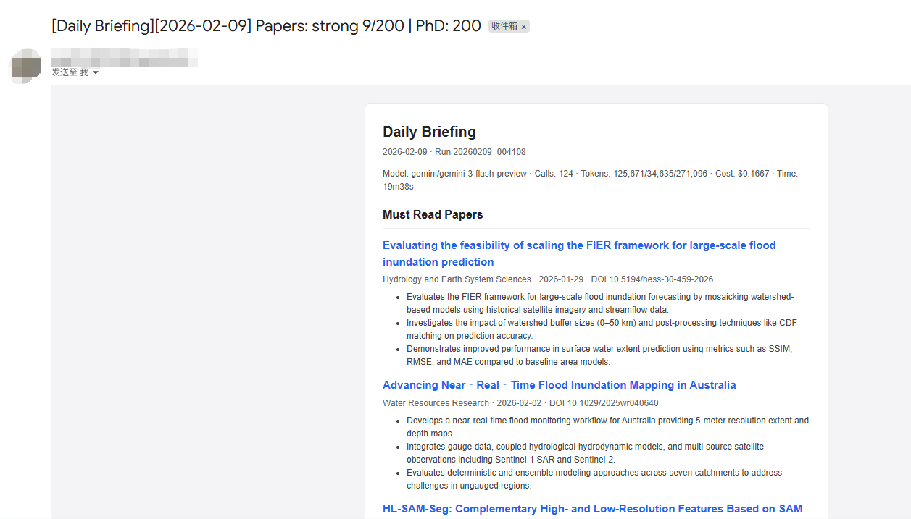
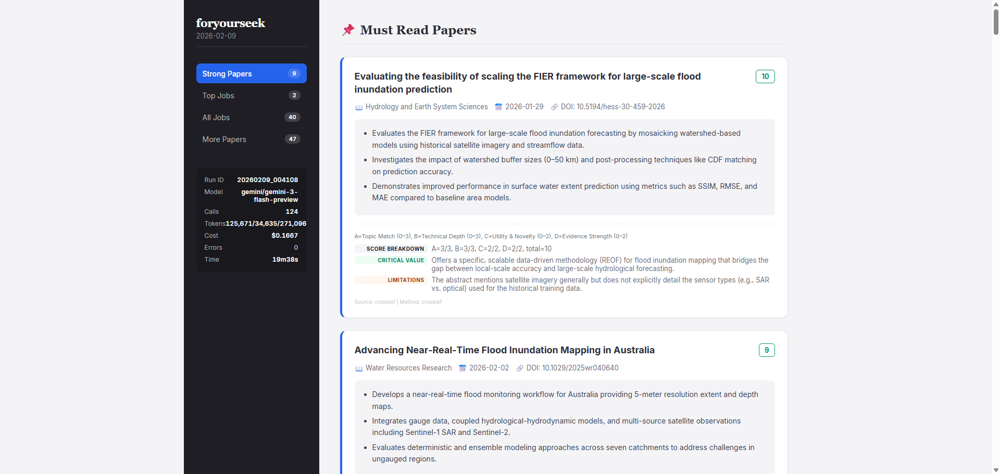

# foryourseek

Personal paper + job watcher.

- Papers: pull new items from RSS feeds, optionally enrich metadata/abstracts, deduplicate in SQLite, and score/summarize.
- Jobs: crawl job boards, extract structured fields when possible, deduplicate, and score/summarize.
- Output: HTML report (and optional email).

This repository is intended to be safe to publish:
- `config.yaml` is ignored (your personal profile and preferences).
- `.env` is ignored (your keys).
- runtime state (`state/`) and logs (`logs/`) are ignored.

## Example Output (Screenshots)





How to update:
- Put redacted screenshots at `assets/email_gmail.png` and `assets/report_html.png` (or change the paths above).
- Commit and push.

Privacy:
- Redact emails, names, institutions, and any keys/tokens visible in the UI.
- Avoid pasting full scraped job descriptions/paper abstracts if you are unsure about redistribution rights.

## Requirements

- Python 3.10+
- Optional: one LLM provider API key (Gemini / OpenAI / MiniMax)
- Optional: SMTP credentials if you want emails

## Install (local)

```bash
python -m venv .venv
source .venv/bin/activate  # Windows: .venv\\Scripts\\activate
pip install -r requirements.txt
```

Dev tools (format/lint):
```bash
pip install -r requirements-dev.txt
```

## Configure

1. Create your local config:

```bash
cp config.example.yaml config.yaml
```

2. Edit `config.yaml` (minimum):

- `profile.field`: your field label (used in prompts and for context)
- `profile.focus`: one sentence about what you care about
- `profile.include_keywords`: terms you want to see more of
- `papers.journals`: RSS feeds you want to monitor
- `jobs.sites`: the job boards you want to crawl

Minimal `profile` example:
```yaml
profile:
  field: "Hydrology / Remote Sensing"
  focus: "SAR-based flood mapping and data assimilation for hydrology."
  include_keywords: ["remote sensing", "SAR", "flood", "hydrology"]
  exclude_keywords: ["medical", "petroleum"]
```

3. Set environment variables (local)

Option A: export in your shell:
```bash
export GEMINI_API_KEY=...
export EMAIL_USER=...
export EMAIL_PASS=...
export TARGET_EMAIL=...
```

Option B: use `.env` for local development:
```bash
cp .env.example .env
source .env
```

Notes:
- `.env` is only for local use. Do not commit it.
- For Gmail you typically need an App Password (not your normal password).

## Environment Variables

LLM:
- `GEMINI_API_KEY` (or `GOOGLE_API_KEY`): Gemini API key
- `OPENAI_API_KEY`: OpenAI API key
- `MINIMAX_API_KEY`: MiniMax API key

Publisher abstract enrichment (optional):
- `PUBLISHER_API_BASE`: e.g. `https://api.elsevier.com/content/article`
- `PUBLISHER_API_KEY`: publisher API key (e.g. Elsevier)
- `PUBLISHER_API_INSTTOKEN`: optional institution token

SMTP (only if you enable email sending):
- `EMAIL_USER`: SMTP username/email
- `EMAIL_PASS`: SMTP password (for Gmail: App Password)
- `TARGET_EMAIL`: recipient email

## Run (local)

Dry-run renders HTML in `logs/` and does not send emails:
```bash
python main.py --dry-run
```

Only run one agent:
```bash
python main.py --dry-run --only papers
python main.py --dry-run --only jobs
```

Override daily limits for a single run:
```bash
python main.py --dry-run --max-papers 20
python main.py --dry-run --max-jobs 50
```

Outputs (per run):
- `logs/run_<run_id>.jsonl`: structured events
- `logs/daily_brief_<run_id>.html`: full HTML report
- `logs/daily_brief_<run_id>_email.html`: email-safe HTML (more conservative markup)

## Testing and Formatting

Format:
```bash
python -m isort .
python -m black .
```

Lint:
```bash
python -m ruff check .
```

Basic sanity:
```bash
python -m compileall -q .
```

## Configuration Reference (what to edit)

Open `config.example.yaml` and copy it to `config.yaml`. The file is already commented; below are the parts people usually change.

### `profile`

Used by both papers and jobs for scoring/summarization.

- `field`: short label (e.g., "Hydrology / Remote Sensing")
- `focus`: one sentence describing your specific interests
- `include_keywords`: positive keywords (matching increases prefilter score)
- `exclude_keywords`: negative keywords (matching decreases prefilter score)

### `papers`

Controls how many items are pulled and how many are sent to the LLM.

- `max_per_day`: max papers included in the final report
- `max_candidates_per_run`: max raw candidates crawled before prefiltering (increase for higher recall)
- `max_llm_per_run`: max papers that can call the LLM per run (cost control)
- `prefilter.*`: weights and thresholds for the cheap keyword-based scoring
- `journals[]`: your RSS sources

Add an RSS source:
```yaml
papers:
  journals:
    - name: "Hydrology and Earth System Sciences"
      rss: "https://hess.copernicus.org/articles/xml/rss2_0.xml"
      enrich:
        enabled: true
        method: "meta_tags"
```

Abstract enrichment:
- Many publishers block scraping. This project supports a generic JSON API enrichment step:
  - `papers.abstract_providers[]`
  - Environment variables: `PUBLISHER_API_BASE`, `PUBLISHER_API_KEY`, optional `PUBLISHER_API_INSTTOKEN`

### `jobs`

- `max_per_day`: max jobs included in the final report
- `max_candidates_per_run`: max raw candidates before prefiltering (increase for higher recall)
- `max_llm_per_run`: max jobs that can call the LLM per run (cost control)
- `degree_keywords`: rule-based "PhD-ish" keywords
- `exclude_keywords`: rule-based exclusions (postdoc/faculty/etc)
- `domain_keywords`: soft match keywords used for prefilter scoring (not a hard filter)
- `resurface.mode`: whether previously-seen jobs can show up again
- `dedup.*`: dedup strategy across multiple boards (URL or semantic key)
- `sites[]`: list of job boards to crawl

Add a job board:
- If the site has a dedicated adapter, set `adapter` to that name and provide `url`.
- Otherwise start with a simple static site config and fill selectors as needed.

Minimal example:
```yaml
jobs:
  sites:
    - name: "Example Jobs"
      adapter: "generic_static"
      url: "https://example.org/jobs/"
      pagination:
        mode: "auto"
        page_param: "page"
        start: 1
      selectors:
        list_item: "a.job-link"
        title: ""
        url: ""
        org: ""
        location: ""
        deadline: ""
        posted_at: ""
        description: ""
        detail_description: ""
```

### `llm`

Provider selection:
- `llm.provider`: `gemini` | `openai` | `minimax`
- `llm.fallback_providers`: list of providers to try if the primary fails
- `llm.per_agent.papers.model` / `llm.per_agent.jobs.model`: optional per-agent overrides

Provider keys:
- Gemini: `GEMINI_API_KEY` (or `GOOGLE_API_KEY`)
- OpenAI: `OPENAI_API_KEY`
- MiniMax: `MINIMAX_API_KEY`

Important knobs:
- `llm.output_language`: `en` or `zh`
- `llm.max_calls_per_run`: global cap across agents
- `llm.max_input_chars_per_item`: input size guardrail
- `llm.on_budget_exceeded`: `degrade` uses rule-based fallback instead of stopping

Pricing (optional, for cost estimation):
- `llm.pricing.*` uses per-1M token prices.

### `email`

Email sending is controlled by `runtime.env`:
- `runtime.env=dev`: dry-run is recommended; `dev_override_to` can force a safe recipient
- `runtime.env=prod`: real sending enabled

SMTP env vars:
- `EMAIL_USER`, `EMAIL_PASS`, `TARGET_EMAIL`

HTML attachment:
- `email.attach_html: true` attaches the full report as a file.

## GitHub Actions Deployment

The provided workflow is conservative by default:
- manual trigger only (`workflow_dispatch`)
- runs `python main.py --dry-run` (no emails)

### 1) Secrets

Repository Settings -> Secrets and variables -> Actions -> Secrets:

- `GEMINI_API_KEY` (if using Gemini)
- `OPENAI_API_KEY` (if using OpenAI)
- `MINIMAX_API_KEY` (if using MiniMax)
- `EMAIL_USER`, `EMAIL_PASS`, `TARGET_EMAIL` (only needed if you enable email sending)
- Optional: `PUBLISHER_API_BASE`, `PUBLISHER_API_KEY`, `PUBLISHER_API_INSTTOKEN`

If the repository is public: be careful with Actions logs and artifacts. Anyone with read access can usually view them.

### 2) Config in Actions (do not commit `config.yaml`)

If you do not want `config.yaml` in the repository (recommended), store it as a secret:

1. Create base64 for your config:
```bash
base64 -w 0 config.yaml
```

macOS alternative:
```bash
base64 config.yaml | tr -d '\n'
```

2. Save it as Actions secret `CONFIG_YAML_B64`.

3. The workflow can decode it into `config.yaml` at runtime.

### 3) Enable schedule (optional)

Edit `.github/workflows/daily_run.yml` and add:

```yaml
on:
  schedule:
    - cron: "17 22 * * *"  # UTC
  workflow_dispatch:
```

### 4) Enable email sending (optional)

1. Edit `.github/workflows/daily_run.yml` and remove `--dry-run`.
2. In your `config.yaml`, set `runtime.env: "prod"`.
3. Add the SMTP secrets.

### 5) Persist state DB (optional)

The workflow can push `state/history.db` to a `state` branch.

This is opt-in because it can leak data in public repos.
Set repository variable `PUSH_STATE=true` to enable.

## LLM Provider Smoke Test (GitHub Actions)

Workflow: `.github/workflows/llm_probe.yml`

This sends a tiny "ping" prompt to the configured provider and prints the raw response.
Use it to debug provider connectivity and response format before running the full pipeline.

## Troubleshooting

### "Failed to load config: Missing required config: .profile"

Your `config.yaml` is missing top-level keys, or it was accidentally written with literal `\\n` sequences.
Use `cp config.example.yaml config.yaml` and edit from there.

### LLM failures / fallback

If the LLM provider fails (timeout, invalid JSON, schema mismatch), the pipeline can fall back to a cheap rule-based summary.
Check:
- `logs/run_<run_id>.jsonl` for `llm_provider_failed` and the error type
- your provider key env vars and `llm.provider`/`llm.provider_options.*`

### Job boards block scraping / 403

Some sites block automated requests. Prefer sources that provide structured HTML/JSON-LD or public APIs.
Reduce frequency and keep a polite `runtime.user_agent`.

## Notes

- Use a private repo if you run this with personal profile data and enable GitHub Actions artifacts.
- Respect each site's robots.txt and ToS.
